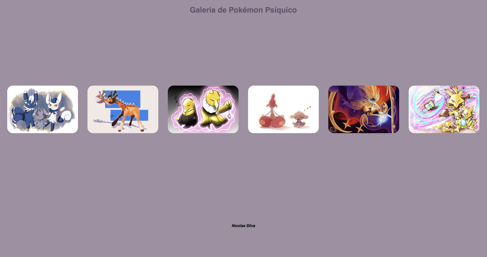

# Galeria de Imagens - Pokémon Psíquico

---
## Sobre
Site simples com algumas fanarts de Pokémon do tipo psíquico. A finalidade dessa página é para experimentar e explorar o conhecimento sobre as linguagens de marcação HTML e CSS durante o curso técnico de DS (Desenvolvimento de Sistemas) do [SENAI Jandira](https://sp.senai.br/unidade/jandira/).

## Tecnologias utilizadas

- HTML
- CSS

## Autor

- Nicolas Silva
